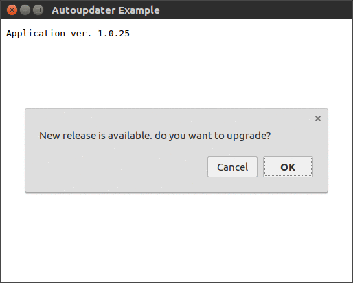

# NW-Autoupdater
[](https://nodei.co/npm/nw-autoupdater/)

Library provides low-level API to control NW.js app auto-updates. This project can be seen as a reincarnation of
[node-webkit-updater](https://github.com/edjafarov/node-webkit-updater), which is not maintained anymore.

## Features
- Node >= 7 compliant
- clean async/await syntax
- supports both Zip/Tar.Gz archives
- fires download/install progress events



# How it works
- It reads manifest from the remote release server
- It checks if the version in the remote manifest greater than one of the local manifest it starts the update flow
- It downloads the latest available version matching the host platform (according to the `packages` map of the remote manifest)
- It unpacks it in a temporary directory
- It closes the app and launches it from the downloaded release (from temporary directory)
- From the downloaded release it backs up actual version and replace it with the new one
- It restarts the app from its original location

## Distribution

- Run release server (see [example](example/server/README.md))
- Add to your client manifest ([package.json](example/client/package.json)) field `manifestUrl` pointing at release server
- Package your app by using [nwjs-builder](https://github.com/evshiron/nwjs-builder) (see [example](example/client/README.md))
- Update the contents of `packages` field in release server manifest (e.g. by running  `node update.js`)
- Update `version` field in release server manifest
- Launch your app and observe it's auto-updating

## Examples

- [Client](example/client/index.html)
- [Server](example/server/README.md)

## API

### Constructor
```
new AutoUpdate( manifest, options );
```

**Params**
- `manifest` - e.g. `require( "./package.json" )`
- `options.executable` - (OPTIONAL) executable if it doesn't match project name
- `options.backupPath` - (OPTIONAL) directory to backup. By default it's <project_name>.bak next to app directory


### readRemoteManifest
Reads package.json of the release server
```
const rManifest = await updater.readRemoteManifest();
```
**Returns**: `Promise<manifest: Object>`

### checkNewVersion
Check if the release server has newer app version
```
const needsUpdate = await updater.checkNewVersion( rManifest );
```
**Params**
- `rManifest` - manifest of the release server

**Returns**: `Promise<needsUpdate: boolean>`


### download
Download last available update to the temp directory
```
const updateFile = await updater.download( rManifest, { debounceTime: 100 });
```
**Params**
- `rManifest` - manifest of the release server
- `options.debounceTime` - (OPTIONAL) debounce time in milliseconds

**Returns**: `Promise<filepath: string>`


### unpack
Unpack downloaded update
```
const extractDir = await updater.unpack( updateFile, { debounceTime: 100 } );
```
**Params**
- `updateFile` - path to downloaded update
- `options.debounceTime` - (OPTIONAL) debounce time in milliseconds

**Returns**: `Promise<directory: string>`

### restartToSwap
Close this version of app and start the downloaded one with --swap param
```
await updater.restartToSwap();
```

**Returns**: `Promise`


### isSwapRequest
Checks if the app launched for swap
```
const needsSwap = updater.isSwapRequest();
```
**Returns**: `boolean`

### swap
Backs up current version of the app and replaces it with the downloaded version
```
await updater.swap();
```

**Returns**: `Promise`

### restart
Restarts the updated app
```
await updater.restart();
```

**Returns**: `Promise`


## Events

### download
Subscribe on download progress event
```
updater.on( "download", ( downloadSize, totalSize ) => {
  console.log( "download progress", Math.floor( downloadSize / totalSize * 100 ), "%" );
});
```

### install
Subscribe on install progress event
```
updater.on( "install", ( installFiles, totalFiles ) => {
  console.log( "install progress", Math.floor( installFiles / totalFiles * 100 ), "%" );
});
```

